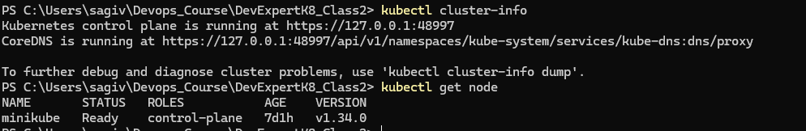
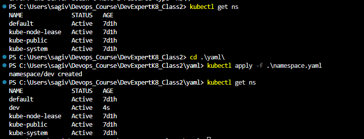
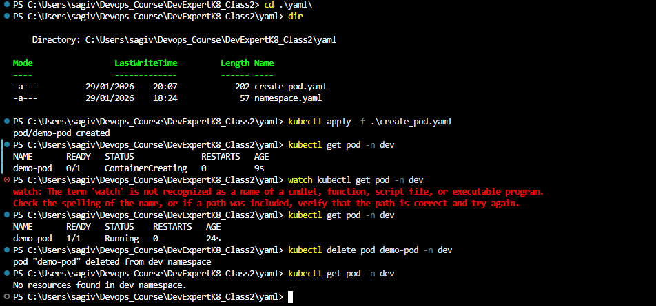
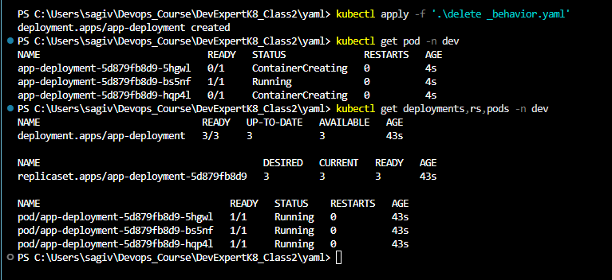
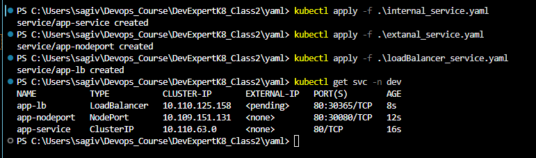
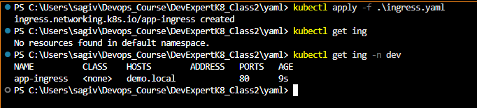
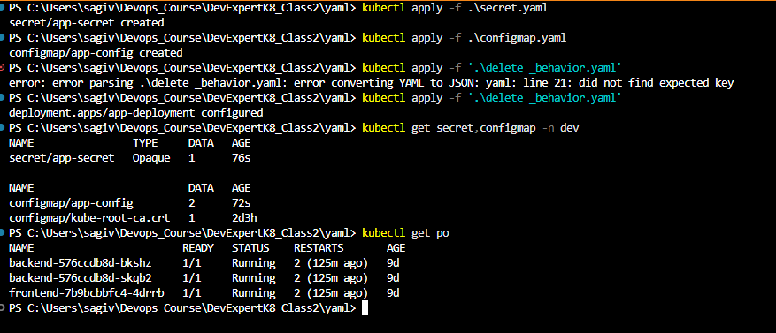
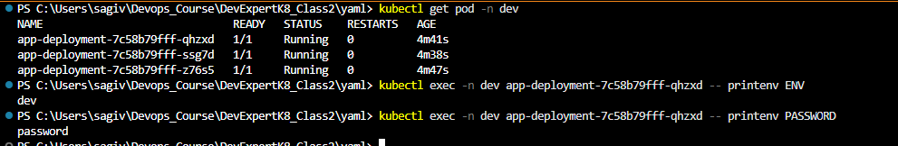

# DevExpertK8_Class2

## Part 0 – Prerequisites
**Commands:**
```bash
kubectl cluster-info
kubectl get nodes
```
### Output 
```text
PS C:\Users\sagiv\Devops_Course\DevExpertK8_Class2> kubectl cluster-info
Kubernetes control plane is running at https://127.0.0.1:48997
CoreDNS is running at https://127.0.0.1:48997/api/v1/namespaces/kube-system/services/kube-dns:dns/proxy

To further debug and diagnose cluster problems, use 'kubectl cluster-info dump'.
PS C:\Users\sagiv\Devops_Course\DevExpertK8_Class2> kubectl get node
NAME       STATUS   ROLES           AGE    VERSION
minikube   Ready    control-plane   7d1h   v1.34.0
```
### Screenshots


## Part 1 – Namespace
**Commands:**
```bash
kubectl create namespace dev
kubectl get namespaces
```
### Output 
```text
PS C:\Users\sagiv\Devops_Course\DevExpertK8_Class2\yaml> kubectl apply -f .\namespace.yaml
namespace/dev created
PS C:\Users\sagiv\Devops_Course\DevExpertK8_Class2\yaml> kubectl get ns
NAME              STATUS   AGE
default           Active   7d1h
dev               Active   4s
kube-node-lease   Active   7d1h
kube-public       Active   7d1h
kube-system       Active   7d1h
```
### Screenshots


### What is a namespace?
A namespace is a logical grouping of resources inside the same Kubernetes cluster.

### Why it is considered logical (not physical) separation
Because all namespaces still share the same nodes and infrastructure.

## Part 2 – Pod
**Commands:**
```bash
kubectl aaply -f ./yaml/create_pod.yaml
kubectl get pod -n dev
kubectl delete pod demo-pod -n dev 
```
### Output 
```text
PS C:\Users\sagiv\Devops_Course\DevExpertK8_Class2\yaml> kubectl apply -f .\create_pod.yaml
pod/demo-pod created
PS C:\Users\sagiv\Devops_Course\DevExpertK8_Class2\yaml> kubectl get pod -n dev
PS C:\Users\sagiv\Devops_Course\DevExpertK8_Class2\yaml> kubectl apply -f .\create_pod.yaml
pod/demo-pod created
PS C:\Users\sagiv\Devops_Course\DevExpertK8_Class2\yaml> kubectl get pod -n dev
PS C:\Users\sagiv\Devops_Course\DevExpertK8_Class2\yaml> kubectl get pod -n dev
NAME       READY   STATUS              RESTARTS   AGE
NAME       READY   STATUS              RESTARTS   AGE
demo-pod   0/1     ContainerCreating   0          9s
PS C:\Users\sagiv\Devops_Course\DevExpertK8_Class2\yaml> watch kubectl get pod -n dev
watch: The term 'watch' is not recognized as a name of a cmdlet, function, script file, or executable program.
Check the spelling of the name, or if a path was included, verify that the path is correct and try again.
PS C:\Users\sagiv\Devops_Course\DevExpertK8_Class2\yaml> kubectl get pod -n dev
NAME       READY   STATUS    RESTARTS   AGE
demo-pod   1/1     Running   0          24s
PS C:\Users\sagiv\Devops_Course\DevExpertK8_Class2\yaml> kubectl delete pod demo-pod -n dev
pod "demo-pod" deleted from dev namespace
PS C:\Users\sagiv\Devops_Course\DevExpertK8_Class2\yaml> kubectl get pod -n dev
No resources found in dev namespace.
```
### Screenshots


### What happens if you delete this Pod? Who recreates it?
If you delete this Pod it will not be recreated automatically because it is not managed by a Deployment or ReplicaSet.

## Part 3 – Deployment 
**Commands:**
```bash
kubectl apply -f '.\delete _behavior.yaml
kubectl get deployments,rs,pods -n dev 
```
### Output 
```text
PS C:\Users\sagiv\Devops_Course\DevExpertK8_Class2\yaml> kubectl apply -f '.\delete _behavior.yaml'
deployment.apps/app-deployment created
PS C:\Users\sagiv\Devops_Course\DevExpertK8_Class2\yaml> kubectl get pod -n dev
NAME                              READY   STATUS              RESTARTS   AGE
app-deployment-5d879fb8d9-5hgwl   0/1     ContainerCreating   0          4s
app-deployment-5d879fb8d9-bs5nf   1/1     Running             0          4s
app-deployment-5d879fb8d9-hqp4l   0/1     ContainerCreating   0          4s
PS C:\Users\sagiv\Devops_Course\DevExpertK8_Class2\yaml> kubectl get deployments,rs,pods -n dev
NAME                             READY   UP-TO-DATE   AVAILABLE   AGE
deployment.apps/app-deployment   3/3     3            3           43s

NAME                                        DESIRED   CURRENT   READY   AGE
replicaset.apps/app-deployment-5d879fb8d9   3         3         3       43s

NAME                                  READY   STATUS    RESTARTS   AGE
pod/app-deployment-5d879fb8d9-5hgwl   1/1     Running   0          43s
pod/app-deployment-5d879fb8d9-bs5nf   1/1     Running   0          43s
pod/app-deployment-5d879fb8d9-hqp4l   1/1     Running   0          43s
```
### Screenshots


### Which object ensures the number of Pods?
The ReplicaSet ensures that the desired number of Pods is always running.
The Deployment manages the ReplicaSe

### Why should Pods not be managed directly?
Pods are ephemeral and do not provide self-healing, scaling, or rolling updates.
Deployments are used because they manage Pods declaratively and automatically recreate them if they fail.

## Part 4 – Deployment → ReplicaSet → Pod Relationship
**Commands:**
```bash
kubectl scale deployment app-deployment --replicas=5 -n dev
kubectl set image deployment/app-deployment app=nginx:latest -n dev
```
### Output 
```text
PS C:\Users\sagiv\Devops_Course\DevExpertK8_Class2\yaml> kubectl scale deployment app-deployment --replicas=5 -n dev        
deployment.apps/app-deployment scaled
PS C:\Users\sagiv\Devops_Course\DevExpertK8_Class2\yaml> kubectl get deployments,rs,pods -n dev
NAME                             READY   UP-TO-DATE   AVAILABLE   AGE
deployment.apps/app-deployment   5/5     5            5           14m

NAME                                        DESIRED   CURRENT   READY   AGE
replicaset.apps/app-deployment-5d879fb8d9   0         0         0       14m
replicaset.apps/app-deployment-77cf88dc74   5         5         5       4m33s

NAME                                  READY   STATUS    RESTARTS   AGE
pod/app-deployment-77cf88dc74-c7xg8   1/1     Running   0          4m33s
pod/app-deployment-77cf88dc74-ddzh9   1/1     Running   0          4m33s
pod/app-deployment-77cf88dc74-hjqdp   1/1     Running   0          4m33s
pod/app-deployment-77cf88dc74-skpzq   1/1     Running   0          4m27s
pod/app-deployment-77cf88dc74-sm8kc   1/1     Running   0          4m29s
PS C:\Users\sagiv\Devops_Course\DevExpertK8_Class2\yaml> kubectl set image deployment/app-deployment app=nginx:latest -n dev
```
### Screenshots


### How many ReplicaSets exist after the update?
Ater the update **two ReplicatSet**
- One old ReplicaSet with 0 replicas (kept for rollback)
- One active ReplicaSet managing the 5 running Pods

### Why does Kubernetes create a new ReplicaSet?
Kubernetes creates a new ReplicaSet to manage a new version of the Deployment during rolling updates and to allow rollback.


## Part 5 – Service Types
**Commands:**
```bash
kubectl apply -f .\internal_service.yaml
kubectl apply -f .\extanal_service.yaml
kubectl apply -f .\loadBalancer_service.yaml
kubectl get svc -n dev
```
### Output 
```text
PS C:\Users\sagiv\Devops_Course\DevExpertK8_Class2\yaml> kubectl apply -f .\internal_service.yaml
service/app-service created
PS C:\Users\sagiv\Devops_Course\DevExpertK8_Class2\yaml> kubectl apply -f .\extanal_service.yaml
service/app-nodeport created
PS C:\Users\sagiv\Devops_Course\DevExpertK8_Class2\yaml> kubectl apply -f .\loadBalancer_service.yaml
service/app-lb created
PS C:\Users\sagiv\Devops_Course\DevExpertK8_Class2\yaml> kubectl get svc -n dev
NAME           TYPE           CLUSTER-IP       EXTERNAL-IP   PORT(S)        AGE
app-lb         LoadBalancer   10.110.125.158   <pending>     80:30365/TCP   8s
app-nodeport   NodePort       10.109.151.131   <none>        80:30080/TCP   12s
app-service    ClusterIP      10.110.63.0      <none>        80/TCP         16s

```
### Screenshots


## Which Service is internal only?
The **ClusterIP** Service is internal-only
It is accessible only fot the Kubernetes cluster and cannot be reached from outside.

## Which Service is best for production?

- **LoadBalancer** (in cloud environments)  
or 
- **ClusterIP + Ingress** (recommended for HTTP applications)

###  Part 6 – Ingress
**Commands:**
```bash
kubectl apply -f .\ingress.yaml
kubectl apply -f .\ingress.yaml
```
### Output 
```text
PS C:\Users\sagiv\Devops_Course\DevExpertK8_Class2\yaml> kubectl apply -f .\ingress.yaml
ingress.networking.k8s.io/app-ingress created
PS C:\Users\sagiv\Devops_Course\DevExpertK8_Class2\yaml> kubectl get ing -n dev
NAME          CLASS    HOSTS        ADDRESS   PORTS   AGE
app-ingress   <none>   demo.local             80      9s
```
### Screenshots


### Does Ingress work without an Ingress Controller?
No. Ingress is only a rule definition and needs an Ingress Controller (NGINX) to work

### Why not expose every Service directly?
Because it increases security risks and complexity.  
Ingress provides one centralized entry point for routing and TLS

##  Part 7 – ConfigMap & Secret
**Commands:**
```bash
kubectl apply -f .\secret.yaml
kubectl apply -f .\configmap.yaml
kubectl apply -f '.\delete _behavior.yaml'
kubectl exec -n dev app-deployment -- printenv ENV
kubectl exec -n dev app-deployment -- printenv PASSWORD

```
### Output 
```text
kubectl get secret,configmap,pods -n dev
NAME                TYPE     DATA   AGE
secret/app-secret   Opaque   1      8m39s

NAME                         DATA   AGE
configmap/app-config         2      8m35s
configmap/kube-root-ca.crt   1      2d3h

NAME                                  READY   STATUS    RESTARTS   AGE
pod/app-deployment-7c58b79fff-qhzxd   1/1     Running   0          7m51s
pod/app-deployment-7c58b79fff-ssg7d   1/1     Running   0          7m48s
pod/app-deployment-7c58b79fff-z76s5   1/1     Running   0          7m57s

PS C:\Users\sagiv\Devops_Course\DevExpertK8_Class2\yaml> kubectl exec -n dev app-deployment-7c58b79fff-qhzxd -- printenv ENV
dev
PS C:\Users\sagiv\Devops_Course\DevExpertK8_Class2\yaml> kubectl exec -n dev app-deployment-7c58b79fff-qhzxd -- printenv PASSWORD
password
```

### Screenshots




##  Part 8 – RBAC & Namespace Isolation
**Commands:**
```bash
kubectl apply -f .\Service_ACC.yaml
kubectl apply -f .\Role.yaml
 kubectl apply -f .\Rolebinding.yaml
kubectl get role pod-reader -n dev
kubectl get rolebinding pod-reader-binding -n dev
kubectl auth can-i get pods 
  --as=system:serviceaccount:dev:app-sa 
  -n dev
  ```
PS C:\Users\sagiv\Devops_Course\DevExpertK8_Class2\yaml> kubectl get role pod-reader -n dev
NAME         CREATED AT
pod-reader   2026-01-31T20:05:30Z
PS C:\Users\sagiv\Devops_Course\DevExpertK8_Class2\yaml> kubectl get rolebinding pod-reader-binding -n dev
NAME                 ROLE              AGE
pod-reader-binding   Role/pod-reader   104s
PS C:\Users\sagiv\Devops_Course\DevExpertK8_Class2\yaml> kubectl auth can-i get pods --as=system:serviceaccount:dev:app-sa -n dev    
yes

### Why is RBAC namespace-scoped?
RBAC is namespace-scoped to limit permissions to a specific namespace and prevent unintended
### What security principle does RBAC enforce?
RBAC enforces the principle of least privilege, granting only the minimum permissions required

 ## Part 9 – Production Thinking


## What changes between dev and prod?
In dev, resource limits/requests are often not set to allow flexibility, while in production they are enforced along with multiple replicas and controlled rollout strategies for stability.
## Why are limits mandatory in production?
Because without limits, a pod can consume too much CPU or memory and impact other workloads, risking cluster instability and outages.
